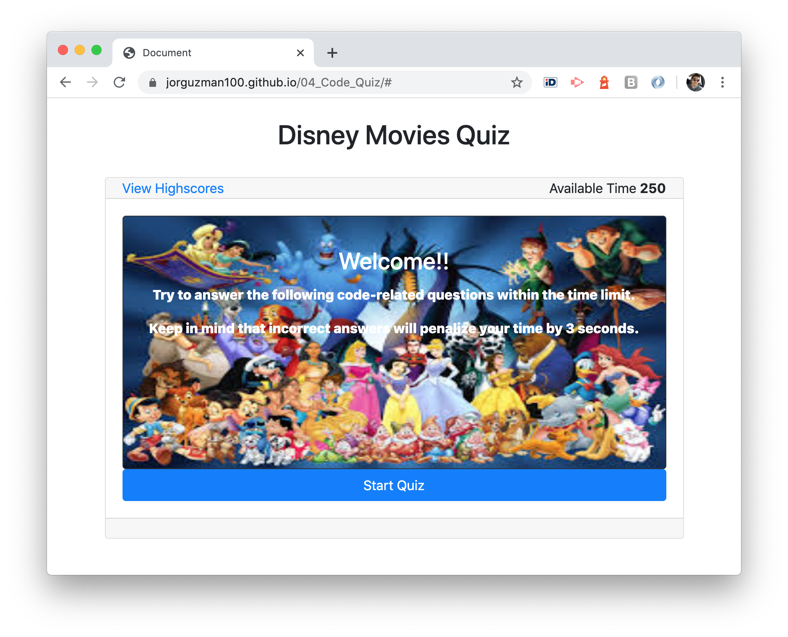
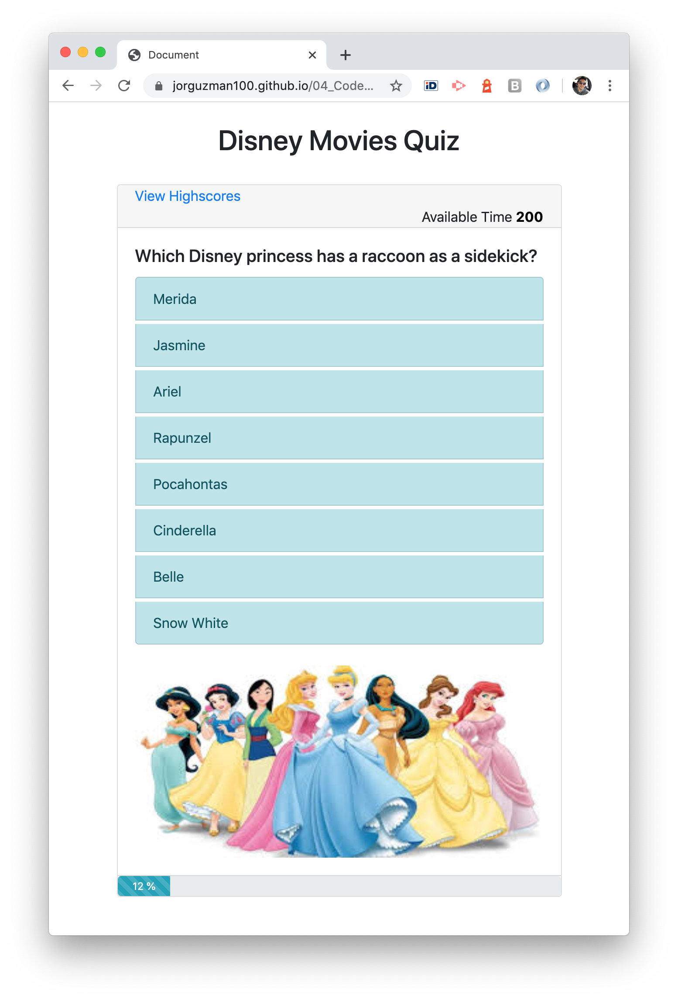
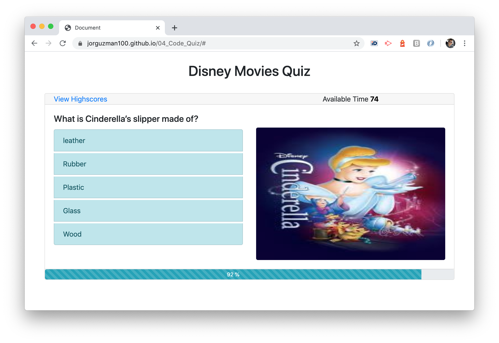
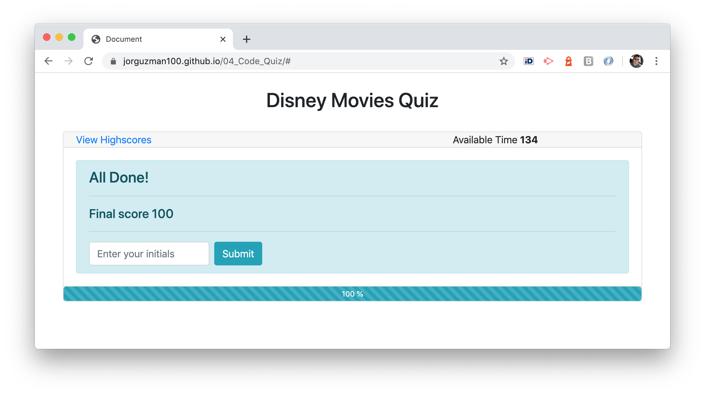
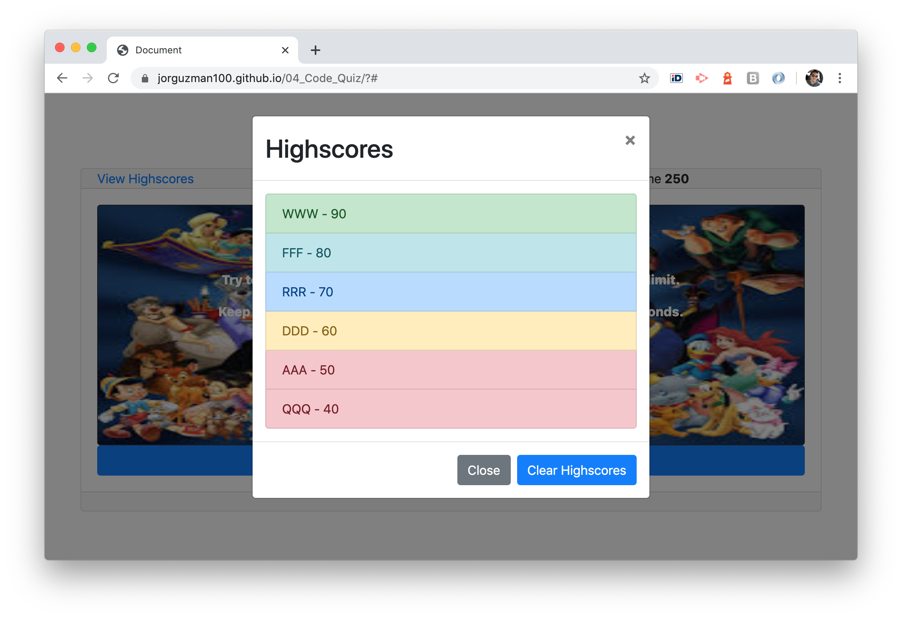

# 04_Code_Quiz
A timed code quiz with multiple-choice questions. \
Built with HTML, CSS, Bootstrap library and JavaScript.

## The Challenge

It is required to create a quiz application, which will include multiple-choice questions, a timer, and the possibility to register Highscores.

Main elements:
- [x] Intro section with instructions.
- [x] Questions display with answers displaying in random order.
- [x] Inmediate visual and audio feedback for the asnwered questions.
- [x] A timer.
- [x] Highscores sortered and registered with localStorage.

Additional given characteristics:
This app will run in the browser and feature dynamically updated HTML and CSS powered by JavaScript code. It will also feature a clean and polished user interface and be responsive, ensuring that it adapts to multiple screen sizes.

## The  development process

In order to accomplish the challenge, the following steps were executed:
1. Understand the challenge and the expected flow for the app.
2. Define complementary breakdown pseudo-code.
3. Code each breackdown element.
4. Test, try and error, and apply corrections.
5. Write proper documentation comments to main code parts.

## The Output

With the described process we were able to create a efficient and responsive quiz application that display questions, provide feedback, show images, provide highscores, all in a friendly manner within the Disney movies context.

__The application__
 

## Installation

The project was uploaded to [GitHub](https://github.com/) at the following repository:
[https://github.com/jorguzman100/04_Code_Quiz](https://github.com/jorguzman100/04_Code_Quiz)

You can access the deployed application with the GitHup Pages link:
[https://jorguzman100.github.io/04_Code_Quiz/](https://jorguzman100.github.io/04_Code_Quiz/)
